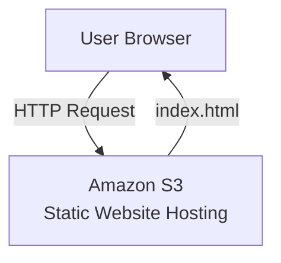

# Static Website Hosting using Amazon S3

## Problem Statement
Organizations require a simple, cost-effective way to host static websites with high availability.

## Solution
Used Amazon S3 static website hosting to deploy a public-facing website without managing servers.

## Architecture
User Browser → Amazon S3 (Static Website Hosting)

## AWS Services Used
- Amazon S3
- AWS IAM

## Deployment Steps
1. Created an S3 bucket
2. Enabled static website hosting
3. Uploaded HTML files
4. Configured bucket policy for public access

## Outcome
- Successfully hosted a static website
- Achi

# Static Website Hosting using Amazon S3

## Architecture Diagram

## Live Website Screenshot

The static website hosted on Amazon S3 is accessible via the S3 website endpoint.

eved serverless, highly available hosting
- Gained hands-on experience with S3 permissions and policies
