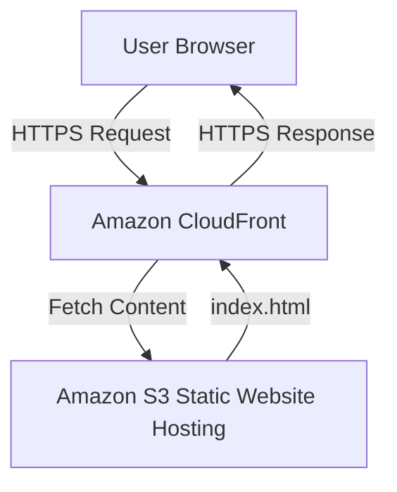
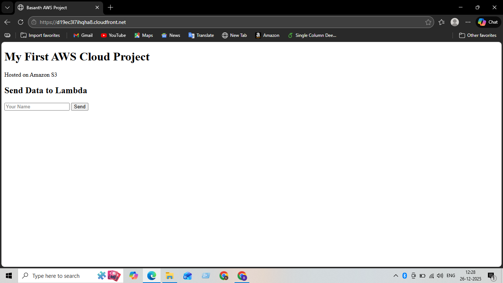
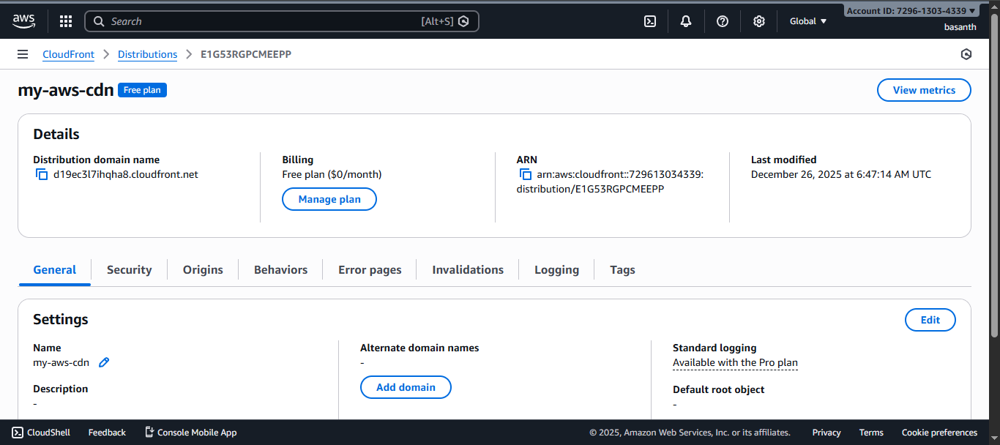

# Secure Website Delivery using Amazon CloudFront

## Problem Statement
Static websites hosted directly on S3 may face latency and lack HTTPS security.

## Solution
Integrated Amazon CloudFront as a Content Delivery Network (CDN) to provide HTTPS and global caching.

## Architecture
User Browser → CloudFront (HTTPS) → Amazon S3

## AWS Services Used
- Amazon CloudFront
- Amazon S3
- AWS IAM

## Deployment Steps
1. Created a CloudFront distribution
2. Configured S3 website endpoint as origin
3. Enabled HTTPS using CloudFront
4. Set default root object for proper routing

## Outcome
- Improved website performance
- Secured website with HTTPS
- Implemented CDN-based architecture used in production environments

## Architecture Diagram

## Live Website Screenshot

The static website is securely delivered using Amazon CloudFront with HTTPS enabled.

## CloudFront Distribution Details

The CloudFront distribution is successfully deployed and serving content from the S3 origin.

