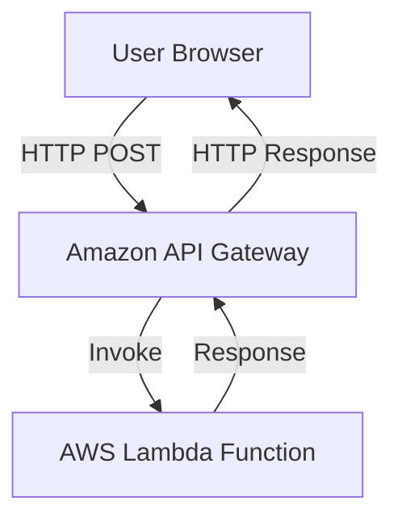
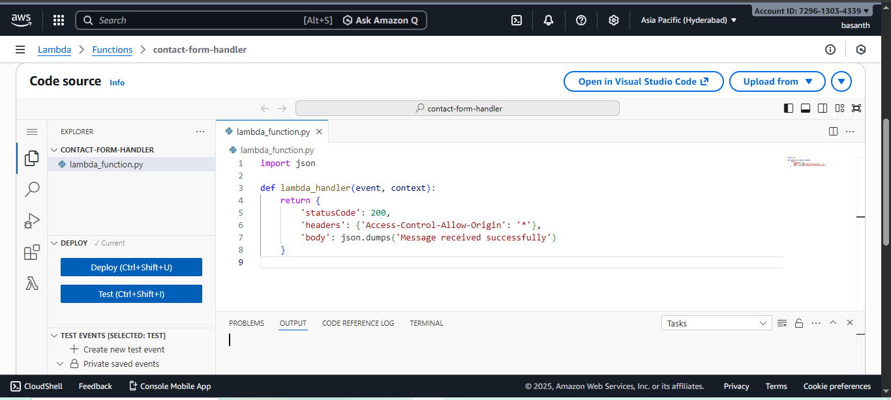
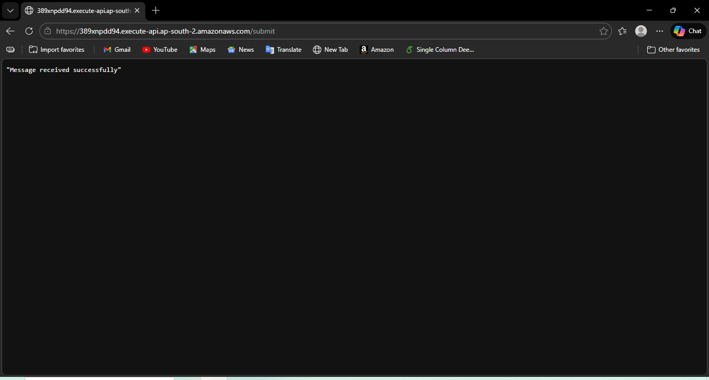

# Serverless Contact Form using AWS Lambda and API Gateway

## Problem Statement
Web applications require a backend to process form submissions without managing servers.

## Solution
Built a serverless backend using AWS Lambda and API Gateway to handle HTTP POST requests from a website.

## Architecture
Website Form → API Gateway → AWS Lambda

## AWS Services Used
- AWS Lambda
- Amazon API Gateway
- AWS IAM
- Amazon CloudWatch

## Deployment Steps
1. Created a Lambda function using Python
2. Configured API Gateway HTTP API
3. Integrated Lambda with API Gateway
4. Enabled CORS for browser access

## Outcome
- Serverless backend deployed successfully
- No server management required
- Scalable and cost-efficient architecture

## Architecture Diagram

## Screenshots

### AWS Lambda Function

### API Gateway Working Response

