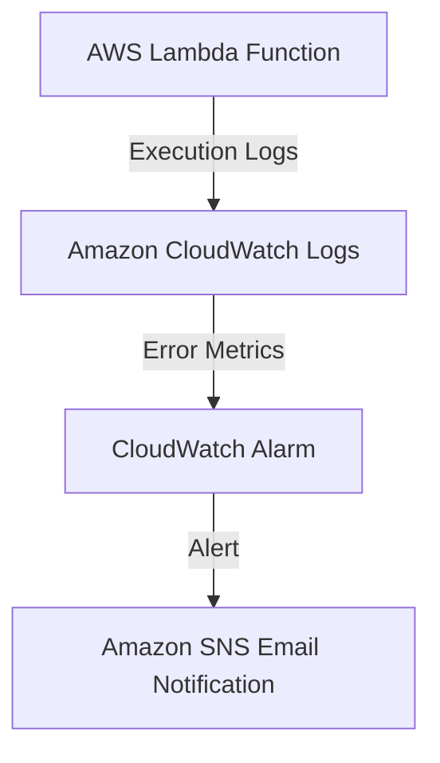
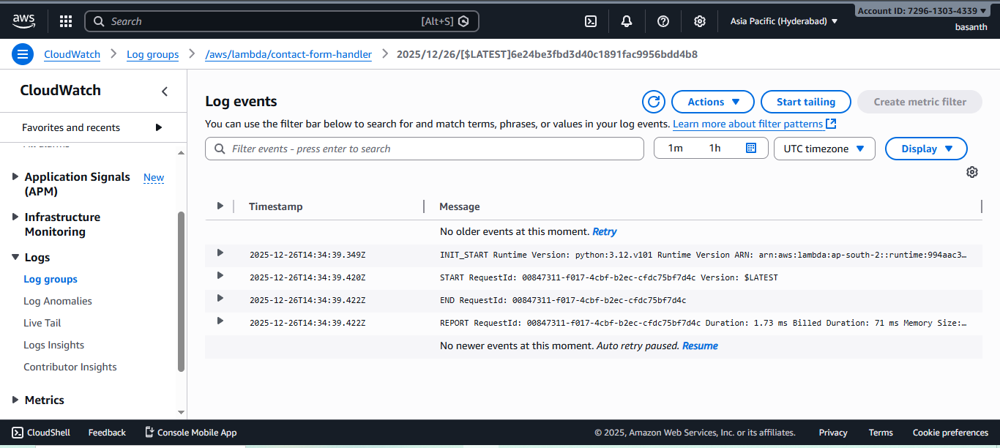
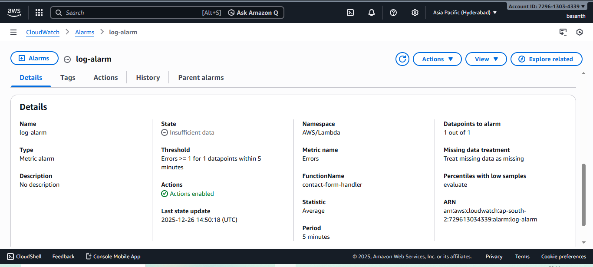

# Monitoring and Alerting using Amazon CloudWatch

## Problem Statement
Production systems require monitoring to detect failures and performance issues.

## Solution
Implemented Amazon CloudWatch logging, metrics, and alarms to monitor AWS Lambda execution.

## Architecture
AWS Lambda → CloudWatch Logs → CloudWatch Alarms → SNS Notification

## AWS Services Used
- Amazon CloudWatch
- AWS Lambda
- Amazon SNS

## Deployment Steps
1. Viewed Lambda execution logs in CloudWatch
2. Configured error metrics
3. Created CloudWatch alarms
4. Set up SNS email notifications

## Outcome
- Real-time monitoring enabled
- Error detection and alerting implemented
- Production-grade observability added to serverless application

## Architecture Diagram

## Screenshots

### Lambda Execution Logs

### CloudWatch Alarm

