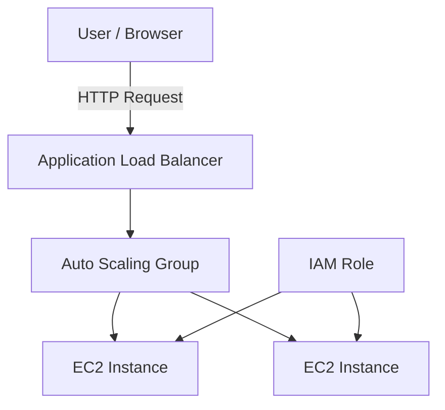
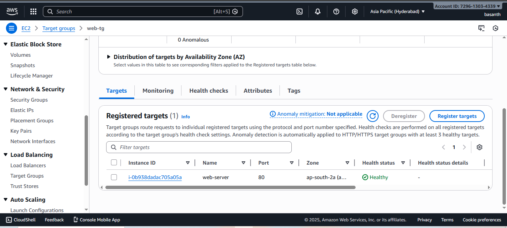
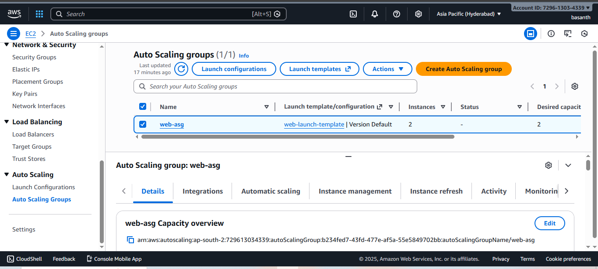

# Highly Available Web Application using EC2, Load Balancer, and Auto Scaling

## Project Overview
This project demonstrates the deployment of a highly available and scalable web application using core AWS infrastructure services. The application runs on multiple Amazon EC2 instances and uses an Application Load Balancer and Auto Scaling Group to ensure reliability, fault tolerance, and consistent performance.

---

## Problem Statement
Single EC2 instance deployments can lead to downtime and performance issues during failures or traffic spikes. A resilient architecture is required to ensure high availability and automatic recovery.

---

## Solution
A highly available architecture was implemented using Amazon EC2 instances behind an Application Load Balancer, managed by an Auto Scaling Group. IAM roles were used to provide secure permissions without hard-coded credentials.

---

## AWS Services Used
- Amazon EC2
- Application Load Balancer (ALB)
- Auto Scaling Group (ASG)
- AWS IAM
- Amazon VPC

---

## Architecture Diagram

## Implementation Steps
1. Created an IAM role for EC2 to enable secure access without using access keys
2. Launched Amazon EC2 instances with Apache web server installed
3. Configured a Target Group with health checks to monitor instance availability
4. Created an Application Load Balancer to distribute traffic across instances
5. Configured an Auto Scaling Group to maintain desired instance capacity
6. Verified high availability by accessing the application through the ALB DNS name

---

## Screenshots

### Application Load Balancer – Website Access

### EC2 Web Server Running Apache

### Target Group Health Status

### Auto Scaling Group Configuration

---

## Outcome
- Deployed a highly available web application using EC2
- Ensured fault tolerance through Load Balancer health checks
- Enabled automatic instance replacement and scaling
- Applied IAM best practices for secure infrastructure access
- Gained hands-on experience with enterprise-level AWS architecture

---

## Key Learnings
- Understanding of high availability and fault-tolerant design
- Practical experience with Load Balancer and Auto Scaling
- Importance of IAM roles in secure AWS deployments
- Real-world troubleshooting and validation of infrastructure components
